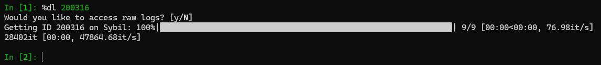
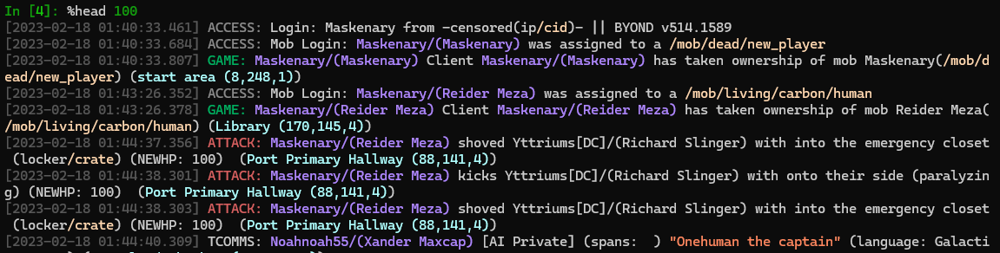
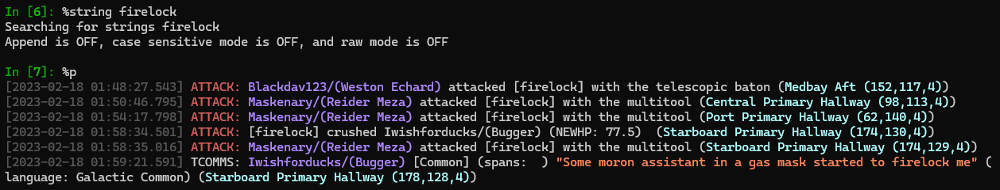
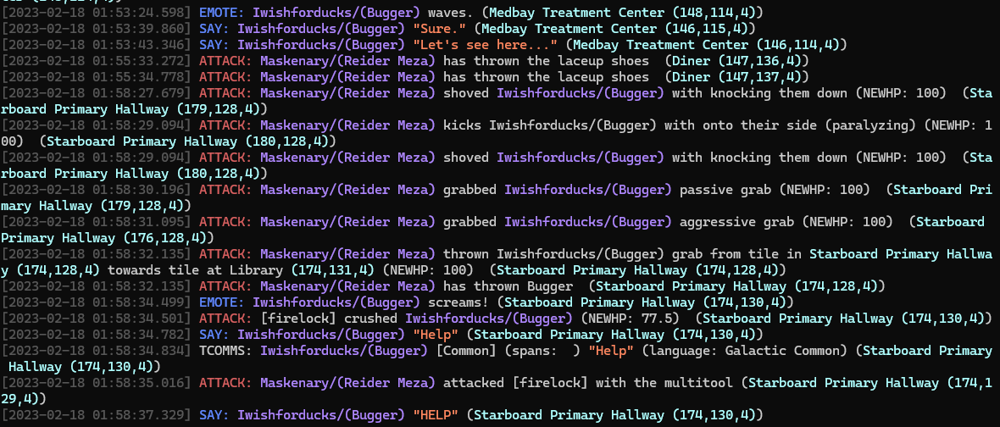
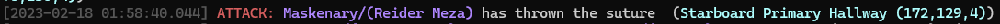
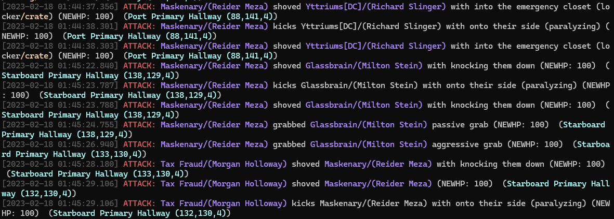
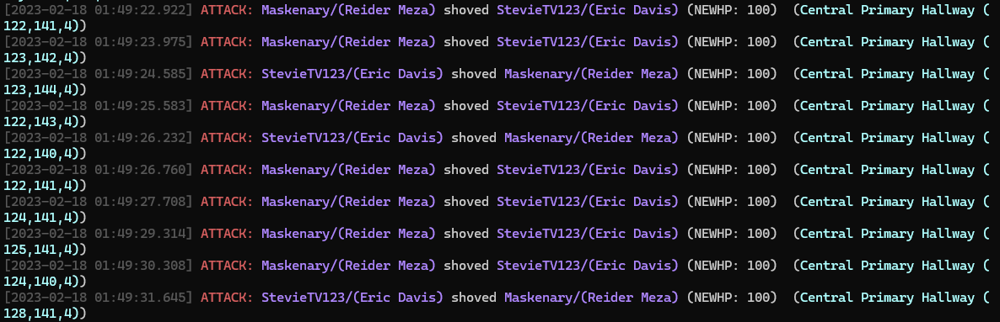
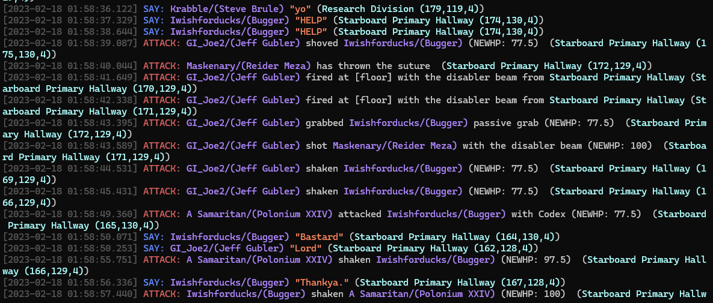
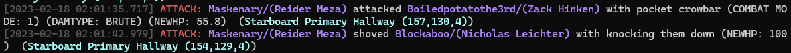

# [Rageguy505] Noted over a firelock crush on LRP (1984? literally?)

[Appeal link](https://tgstation13.org/phpBB/viewtopic.php?f=34&t=33442)

**NOTE**: if you don't know what a command does, add `?` in front or back to find out. Example: `?%dl`

## What happened?

In this appeal Rider Meza apparently wordlessly crushed someone with a firelock. He claims to have thrown sutures immediately afterwards. From the appeal itself we know that at least Iwishforducks and Maskenary are involved.

## The investigation

### Downloading the logs

```py
%dl 200316
```



To download raw logs, type `y` and enter when asked, but we won't be doing it in this specific investigation, as parsed logs has everything we need. The command will download logs from the servers, and store them in a file named `200316.log`. If you quit and want to resume without downloading the logs again, type `%load_logs 200316.log` instead of `%dl`.

### Basic log analisys

First, it's a good idea to look at Reider's actions in the round

```py
%heard Maskenary
%l
```

`l` stands for `length`.

**NOTE**: you don't need to prefix everything with `%`. Try `dl`


Let's quickly take a look at the first 100 logs

```py
%head 100
```



To print out everything, use `p` or `print_logs`

```py
%p
```

It's always smart to use `l` before `p`, as sometimes we have tens of thousands of logs. As you can imagine, that won't help us much. As we have quite a lot of logs we can try searching for "firelock" to get a rough idea of what happened

```py
%string firelock
%p
```

For more info on the modes mentioned when `%string` was used, click [here](../ss13_tools/log_buddy/README.md#available-commands-cheat-sheet)



Quick sidenote: if you see something that isn't correctly highlighted, please open a [bug report](https://github.com/RigglePrime/SS13-tools/issues/new/choose)! (this specific one with iwishforducks has been already fixed)

### Verifying the appealant's claims

We found the core of the incident! Let's take a step back and isolate these two, so we can see their interactions.

```py
%reset
%ckey iwishforducks maskenary
%p
```

**NOTE**: you don't need to prefix everything with `%`. Try `dl`

It's recommended to clear your screen with `%cls` before every `%p` so you don't get confused

If we scroll a bit we can see Reider attacking Bugger with no prior interaction:


Feel free to make your window larger! I kept it relatively small so the images clearer.



Reider wasn't lying in the appeal, he threw the suture after firelocking Bugger. What else has Reider been up to? Let's undo that last step, and find out.

```py
%undo
%heard Maskenary
%p
```

**NOTE**: if there's too many logs a pager will activate Press enter to or space to advance a screen, and q to quit. You may try `%head` or `%tail` instead. (you can run both commands with a number, to change the amount printed: `%head 50`)

This prints out quite a lot of logs! Everything is neatly coloured, but maybe you want to want to read the logs elsewhere, like Notepad++ or Visual Studio Code. To do that we could either save this to a file with `%s` or `%s filename here`, or `%clip` and copy everything in the filter to the clipboard.

To make this slightly easier, let's clear our screen and limit the logs to say and attack only. (alternatively just exclude telecomms with `%type !TCOMMS`). Remember that you can also always filter logs by ckey is `%heard` outputs too many!

```py
%cls
%type SAY ATTACK
```

### Further exploration

This is where the useful commands end and exploration begins

More random violence, without any prior interactions


Even more violence with 0 say logs in between


The incident from before, where an officer tried disabling him


Really seems like Reider is just shoving random people constantly


From this point on it's just more pointless shoving, shoe stealing, the short king of medbay part, and breaking into the AI chamber with hulk and an esword.

## Conclusion

Reider wasn't lying in the appeal, but with our investigation we found out the true extent of their shoving adventures. With this information we can confidently respond to their appeal.
